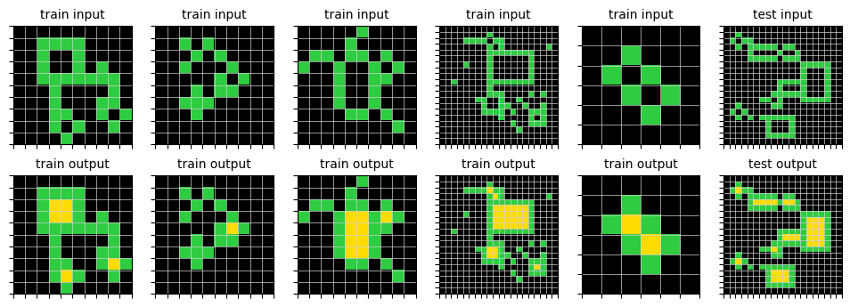
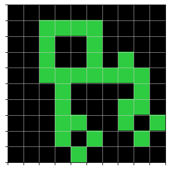
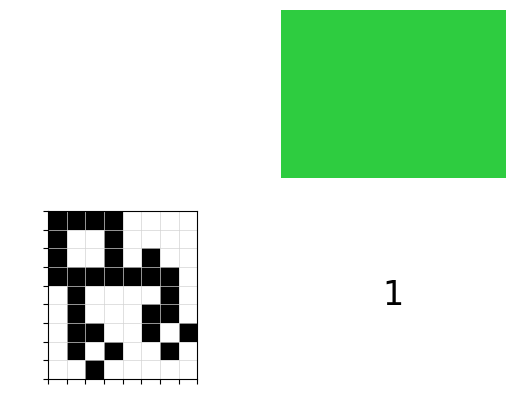
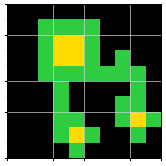
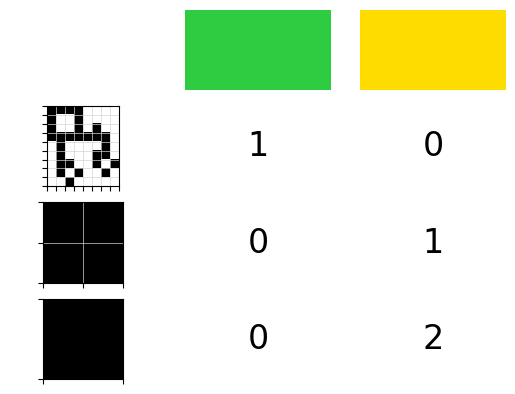

# arc-agi-2

This repository helps to visualize the tasks in the ARC-AGI-2 dataset and to create analyses of shapes for each task.

## Installation
Install the Python dependencies using pip:
```bash
pip install -r requirements.txt
```

## How to use
### Reading the data
```python
from arcagi.data import Arcagi2
data = Arcagi2().get_data()
```
### Reading and visualizing a task
```python
from arcagi.task import Task
task = Task(data['training_challenges']['009d5c81'])
task
```
\> output


___
```python
task.is_same_size_all_input_output()
```
\> output
`False`
___
```python
task.is_same_size_each_input_output()
```
\> output
`True`
___
### Analyzing the shapes within a grid of a task
```python
from arcagi.grid import Grid
g = Grid(task.train[0]['input'])
g
```
\> output


___

```python
from arcagi.shapes import Shapes
s = Shapes(g.grid, g.shapes[2]) # there are 2 types of shape, g.shapes[1] and g.shapes[2], without or with diagonals
s
```
\> output


___

```python
from arcagi.grid import Grid
g = Grid(task.train[0]['output'])
g
```
\> output



```python
s = Shapes(g.grid, g.shapes[2])
s
```
\> output


